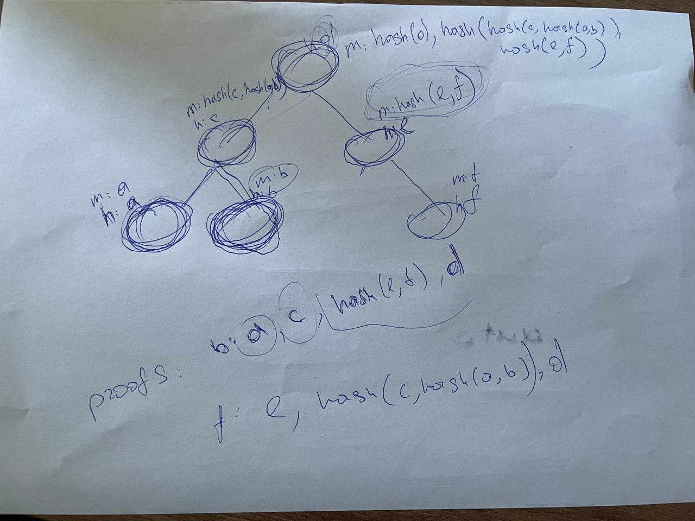

# Treap-based dynamic Merkle tree

[](https://opensource.org/licenses/MIT)

Proof of concept for dynamic Merkle tree.
Treap as primary data structure used to achieve logarithmic inserting/removing.

## Usage
```go
package main

import (
	"math/rand"
	
	merkle "github.com/olegfomenko/crypto/dynamic-merkle"
)

func main() {
	tree := merkle.New()
	
	// Insert
	tree.Insert([]byte("hash"), rand.Uint64())
	
	// Merkle path
	path := tree.MerklePath([]byte("hash"))
	
	// Merkle Root
	root := tree.MerkleRoot()

	// Remove
	tree.Remove([]byte("hash"))
}
```

## Related docs

Treap description: "<https://en.wikipedia.org/wiki/Treap>"

Merkle tree description: "<https://en.wikipedia.org/wiki/Merkle_tree>"

